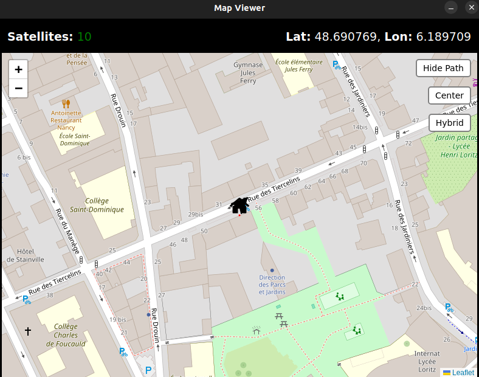
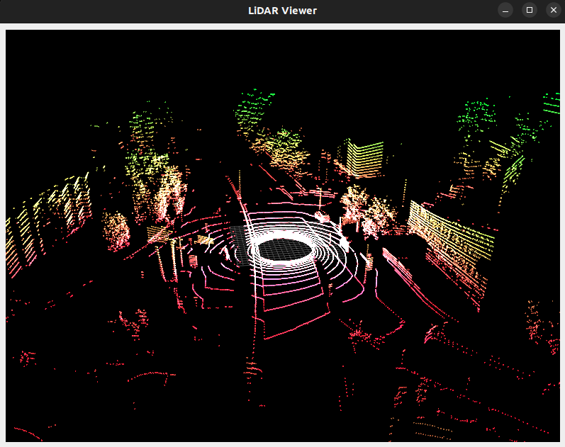
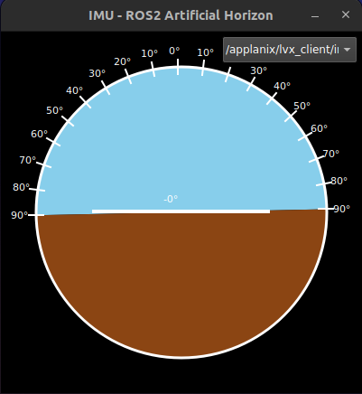
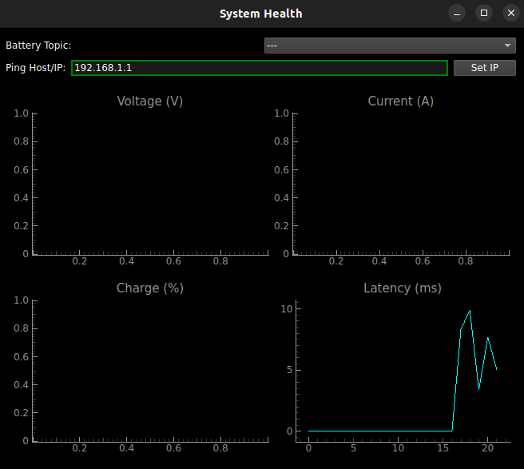
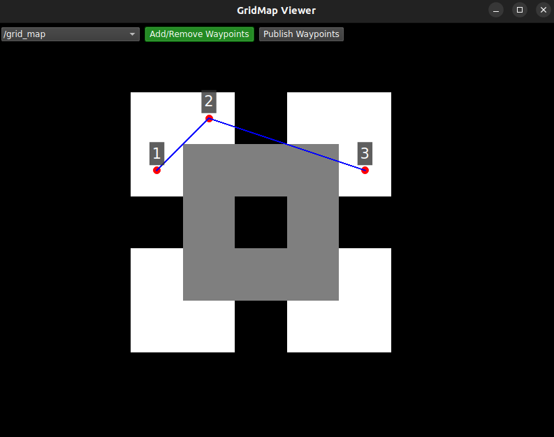

# Implemented Windows

This document lists all the GUI windows currently available in the `ros2_teleoperation` package, including a brief description and representative image.

| Name           | Image                                                                 | Description                                                                 |
|----------------|------------------------------------------------------------------------|-----------------------------------------------------------------------------|
| Map Viewer     |                                   | Displays real-time GPS position and supports waypoint interaction.          |
| LiDAR Viewer   |                               | 3D visualization of LiDAR point cloud data in real time.                    |
| IMU Viewer     |                                   | Shows IMU angles and accelerations in a simplified visual representation.   |
| Camera Viewer  |  *(if exists)*              | Live feed of the robot's onboard camera for teleoperation purposes.         |
| Plot Viewer    |                                  | Displays real-time data from various sensors and allows for data analysis.  |
| GridMap Viewer |                            | Displays a grid map of the environment, useful for navigation and planning. |
| Ortogonal Viewer |                      | Displays orthogonal views of the robot and the environment for better spatial understanding. |
| Gstreamer Viewer |  *(if exists)* | Displays video streams from the robot's cameras using GStreamer.            |
